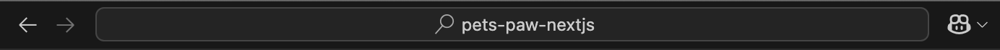
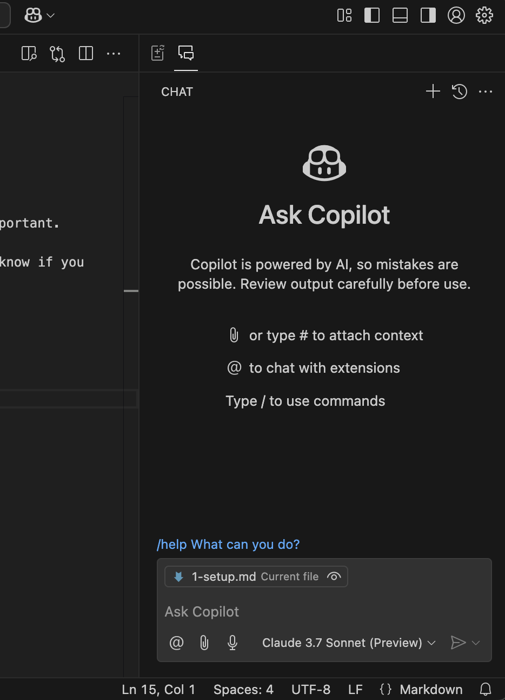
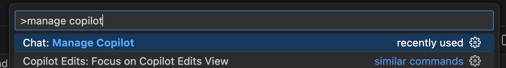
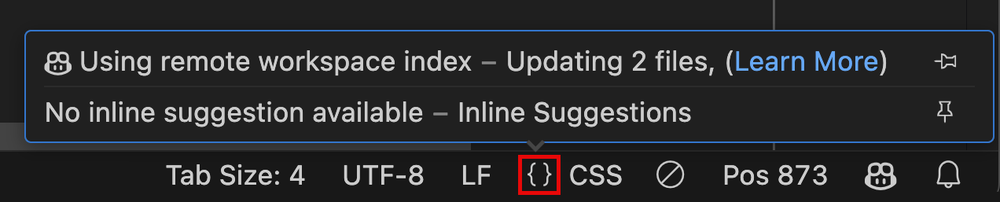
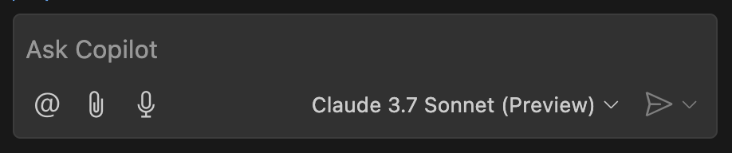
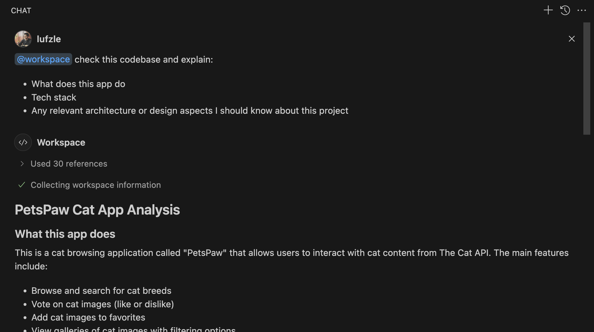
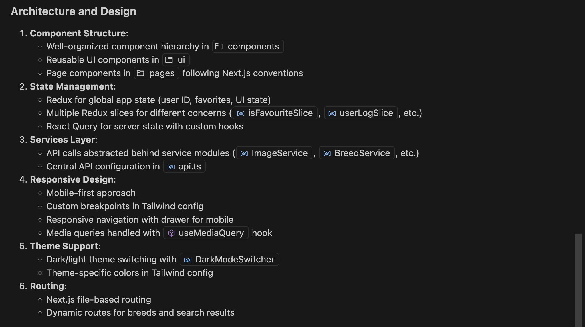

# Copilot Guide

## 1. Setup Copilot

### Introduction

This guide was written with VS Code 1.98.1 - future versions may affect what's shown here. What's important.

Previous versions don't have Copilot Chat, which is a key feature we'll be using in this guide. You know if you have Copilot Chat because you see a Copilot button right of the search bar:

When you click that button, the Copilot chat side panel will open like this:

### Configuring Copilot

First things first, let's make sure to configure some basic settings in Copilot. Open the quick action menu on VSCode, and select Manage Copilot:

This will open a browser window to the GitHub Copilot settings page. Make sure to configure:

* __Copilot Chat in the IDE__: Enabled
* __Suggestions matching public code (duplication detection filter)__: as you see fit
* __Allow GitHub to use my data for product improvements__: probably uncheck unless you are working on OSS
* __Allow GitHub to use my data for AI model training__: should be Disabled by default
* __Copilot can search the web__: as you see fit
* __Anthropic Claude 3.5 Sonnet in Copilot__: Enabled (we'll be using 3.7, but leave it enabled)
* __Anthropic Claude 3.7 Sonnet in Copilot__: Enabled
* __Google Gemini 2.0 Flash in Copilot__: as you see fit - may be useful

### Building the workspace index

It's important that you understand how Copilot gets to know and understand your codebase. Take a moment to read [Making Copilot Chat an expert in your workspace](https://code.visualstudio.com/docs/copilot/workspace-context).

If the project is connected to a GitHub repository, Copilot will automatically use the remote index if present, or will start building it immediately. You can always check status and details by clicking the `{}` button on the VSCode bottom status bar:

### Copilot Instructions

While Copilot is generally good at catching conventions and practices in the project, it's always a good idea to be explicit and specific about architecture decisions, style guidelines and other nuances you want Copilot to pay attention to. This will translate in more accurate code generation and less time wasted in correcting the generated code.

You can give these instructions to Copilot by writing a [copilot-instructions.md](https://code.visualstudio.com/docs/copilot/copilot-customization#_use-a-githubcopilotinstructionsmd-file) file.

### Getting ready with Copilot Chat

Ready to start playing with Copilot? Make sure you choose Claude 3.7 Sonnet as the Large Language Model for best results:

Now let's start by asking Copilot to explain the project to us, including tech stack and any relevant system design observations:

As you can see, especially for newbies to the project, it can be really insightful to have a first glimpse of how things are done in this project in a way that lets you follow up with more questions.

Alright, now that we are ready, [let's move to the next step](2-generate-unit-tests.md) and start generating tests in our project!