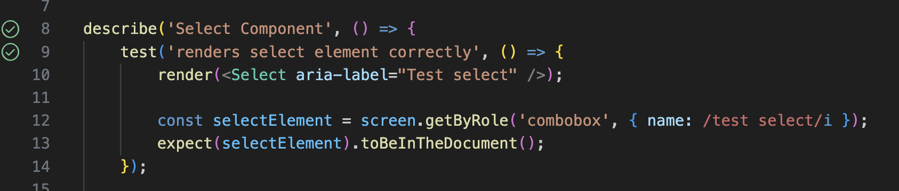

# Copilot Guide

## 2. Generate Unit Tests

### Introduction

Let's see how we can use Copilot to quickly generate unit tests - the core point of this guide.

While the example project used in this guide has the test setup done with Jest, there are no tests yet. Let's look for an easy case to start with.

### Example 1: a Select component

Consider [src/components/ui/select/select.tsx](../src/components/ui/select/select.tsx) - a simple React Functional Component for a dropdown.

Before we jump into code generation, let's see how we can leverage the "Chat" part of Copilot Chat to have some developer feedback as if we would be pairing up with a (human) coworker.

Let's open [select.tsx](../src/components/ui/select/select.tsx) in our editor, and ask Copilot how does it think about it in terms of good design and testeability:


While responses might vary depending on the Large Language Model you choose and what's in your [Copilot Instructions file](1-setup.md#copilot-instructions), you should get a response similar to this:

> Looking at your select component, it's fairly simple but has a couple of design issues that affect both its usability and testability:
>
> ###### Issues with the current implementation:
> 1. Props handling:
> * `delete props.className` mutates the props object, which is not recommended in React
> * The component assumes `props.className` is always defined (could cause `undefined` in classNames)
> 2. ClassNames usage:
> * Forces `props.className` to be treated as a string when it might be undefined
> 3. Testability concerns:
> * There's no data-testid or other test hooks
> * Limited props forwarding documentation

As you see, this is a handy practice that may save you some time - remember, you can test as much as your code allows for it!

#### Generating unit tests

So, we know we might run into issues trying to write test for this component as-is. But let's try anyway:


Copilot will come up with a plan for testing this component and proceed to write the code as well:

> I'll create unit tests for the Select component.
> ###### Plan:
> 1. Set up the testing environment with necessary imports
> 2. Test if the component renders correctly
> 3. Test if the className prop is applied correctly
> 4. Test if the component passes through other props correctly
> 5. Test if the children are rendered properly

As you can see, even with the simplest prompt, Copilot did come up with a good bunch of scenarios to cover. 

Let's apply the edits to the new file `select.test.tsx`:


#### Tuning Copilot 

Wait - let's take a look at the generated tests:


Copilot decided to use `data-testid` which might not be considered best practices, according to [Testing Library Guiding Principles](https://testing-library.com/docs/guiding-principles).

While this is beyond the scope of this guide, let's use it as an excuse to see how you could ask Copilot to follow these principles.

Remember the [Copilot Instructions file](1-setup.md#copilot-instructions) mentioned earlier? Let's add the following statement:

```
## Tests

### Avoid using data-testid

The Testing Library philosophy recommends prioritizing selectors in this order:

1. Accessible roles, labels, and attributes users would interact with
2. Semantic HTML elements
3. Text content users would see
4. Only then, if necessary, `data-testid`

This approach keeps tests focused on functionality as experienced by users rather than implementation details.

#### Recommendation
Use `data-testid` when:

* Other selector approaches would be brittle
* The element has no accessible name or role
* You need to target elements that users don't directly interact with
```

Now let's get rid of `select.test.tsx` and ask Copilot to generate unit tests again. You will see that it's now considering the instructions file:


And now the tests use a role selector:



